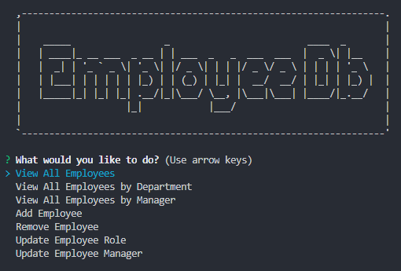

# employee-db


## Description
    
Employee-db is an easy to use CLI application for anyone to interact with and make changes. This Content Management System provides access to manage a company's employee database using NodeJS, Inquirer and MySQL.
    

## Content

* [GitHub Repository](https://github.com/Rudy-Menjivar/employee-db/)

* [Demo](#video-demo)

* [Installation](#installation)

* [Usage](#usage)

* [Contributing](#contributing)

* [Questions](#questions)

## Video-Demo
<a href="https://drive.google.com/file/d/1IPAS4arbrdidgVSikwsmyykH3chVM_FM/view"></a>

## Installation

Run the following command to install the required dependencies:
```
npm install
```
  

## Usage

Run this command to invoke this application:
```
node server.js
```
  

## Contributing
    
Any community contributions will help in achieving this project's success, so any help is greatly appreciated.
    
To participate in this project, please review the following guidelines:
    
1. Create a branch for your update (after forking and cloning)
    
   `git checkout -b <branchName>`
    
2. Make changes or additions to new or existing file & stage it
    
   `git add <fileName.ext>`
    
3. Commit your file by adding comments about code enhancements
    
   `git commmit -m <your code comments>`
    
4. Push your changes with your remote branch name
    
   `git push -u origin <branchName>`
    
5. Finally, submit [feature requests and bugs](https://github.com/Rudy-Menjivar/employee-db/issues) and open a [pull request](https://github.com/Rudy-Menjivar/employee-db/pulls)


## License

Copyright (c) Rudy-Menjivar. All rights reserved.
    
Licensed under the [MIT](./LICENSE.txt) license.


## Questions
  
If you have any questions then feel free to contact me, and you can find my complete work at GitHub.
- [Email](mailto:rudy.menjivar@gmail.com)
- [GitHub](https://github.com/Rudy-Menjivar)